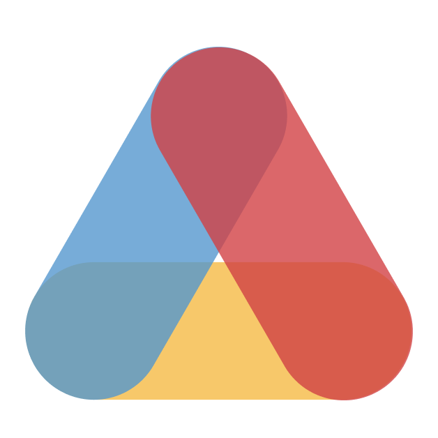
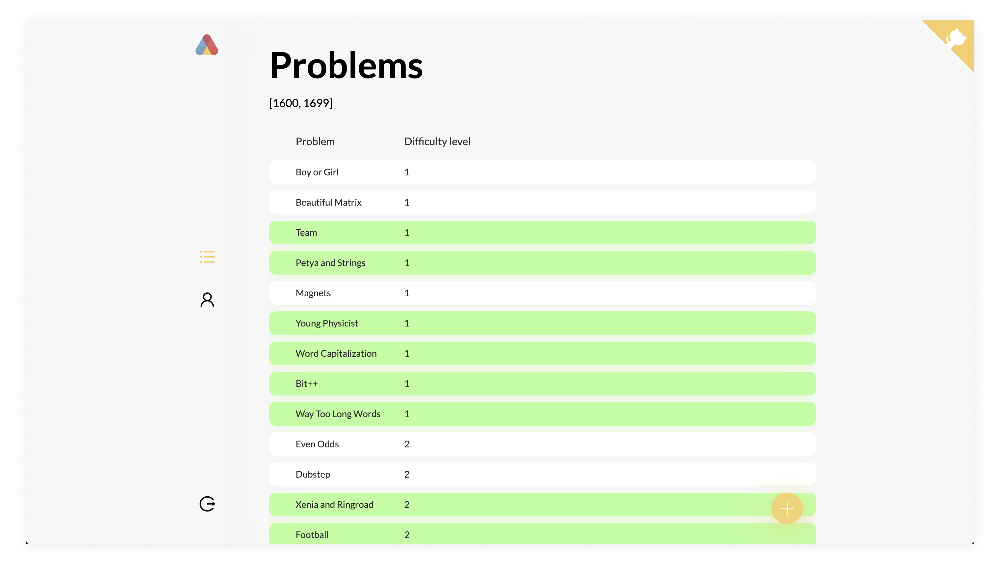

<p align="center">
  
</p>

<p align="center">
 
</p>

<p align="center">Ladders consisting of Codeforces problems for your rating.</p>

> **Important**: The web app is inspired by [A2OJ](https://www.a2oj.com/) which is retired by now. All of the ladders content belong to [Ahmed Aly](https://codeforces.com/profile/ahmed_aly).



### Idea

Solve Codeforces problems from the ladders that correspond to your rating and improve your skills.

### Organized

Join the ladders you want to solve and track your progress.

### Beautiful

Clean design with the focus on details.

## Setup

### Prerequisites

1. Install PostgreSQL and Redis on your computer.
2. [Add a PostgresSQL user](https://medium.com/coding-blocks/creating-user-database-and-adding-access-on-postgresql-8bfcd2f4a91e) with the desired username and no password. (You can change what these values are in the [ormconfig.js](https://github.com/ironsoul0/laddy/blob/master/ormconfig.js))
3. Create database called `laddy` using the user you have created.

### Filling environmental variables

In order to work on Laddy locally, you must assign values to some env. variables both in the [client](https://github.com/ironsoul0/laddy/tree/master/packages/client) and [server](https://github.com/ironsoul0/laddy/tree/master/packages/server) folders.

- Client:
  - **REACT_APP_GRAPHQL_URI**: URL for the GraphQL server. (`http://localhost:4000/graphql` by default)

- Server:
  - **ACCESS_TOKEN_SECRET**: Secret used for signing JWT tokens on the backend.
  - **APP_URL**: Your app base URL. (`http://localhost:3000` by default)

### Install

```bash
git clone https://github.com/ironsoul0/laddy.git
cd laddy
npm install
npm run bootstrap
```

### Run

```bash
npm start
```

### Seed data

To seed the database with some test data, use the following command. Be aware that it drops the database first.

```bash
npm run fill-data
```

## Contributing

Laddy is an open source project. Feel free to contribute and suggest any improvements. All bugs and issues should be reported to the [issues](https://github.com/ironsoul0/laddy/issues) tab.

This repository is a monorepo for both client and server parts of the website. Both client and server are written in TypeScript and use safe type-checking. Client uses React and Apollo, while server uses GraphQL and PostgreSQL database.

## Acknowledgements

- Thanks to [Ahmed Aly](https://codeforces.com/profile/ahmed_aly) for the creation of A2OJ and generating ladders.

## License

This project is open source and available under the [MIT License](LICENSE).
